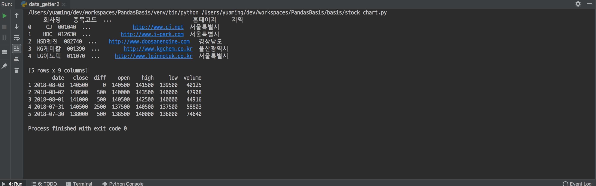
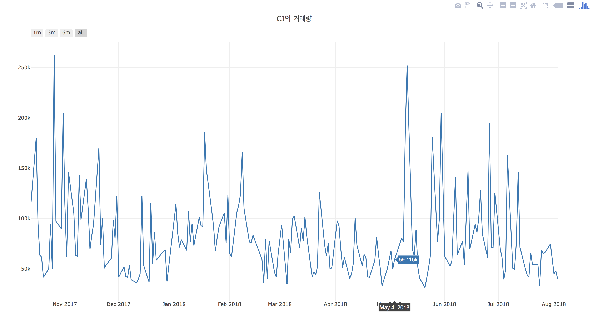

= 주식 정보 크롤링 하기

===== 실습 환경
* Python 3.x 
* Pycharm
* 필요한 라이브러리
** DateTime
** html5lib
** lxml
** numpy
** pandas
** plotly
** requests
** xlrd
  
===== 실습 결과

===== 참고 
* https://woosa7.github.io/krx_stock_master/[거래소 상장법인 목록 크롤링]
* https://finance.naver.com[네이버 금융]
* https://financedata.github.io/posts/naver-finance-finstate-crawling.html[네이버 파이낸스 - 재무제표 크롤링]
